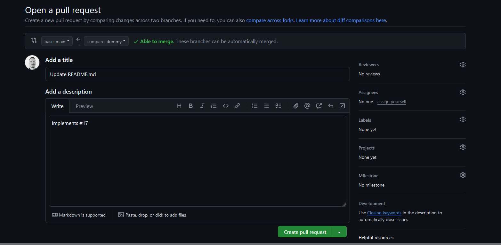
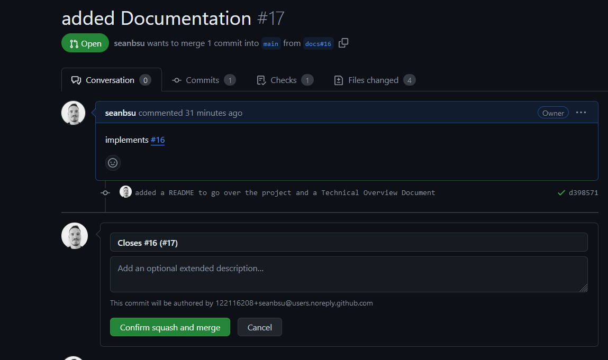

# Contributing

## Issue Assignment
To contribute, browse the `Issues` tab in the repository and find a task you'd like to work on. Comment on the issue indicating your interest in working on it. Once approved, create a fork of the repository to work on your task.

## Pull Requests
When you're ready to submit your work, create a Pull Request (PR) and follow these guidelines:

- **Title**: Create a concise title that describes the work completed.
- **Description**: In the PR description, on the first line, include `Implements #IssueNumber` to link the PR to the relevant issue.
- **Comments**: Do not include any other comments in the description.

Your PR should look something like this:

When ready, add an admin as a reviewer to get approval for your PR.

## Merge
Once your PR is approved, and all checks have passed, use the "Squash and Merge" option to merge your changes into the `main` branch.

1. **Delete Commit Messages**: Remove all commit messages from the extended description.
2. **Rename Title**: Rename the title to follow the format `Closes #IssueNumber (#PRnumber)`.

Example:

## Adding Services to the Project

To add a new service to the project, follow these steps:

1. **Create a New Folder for the Service**

   - In the `Services` folder, create a new folder named to describe your service. This will help organize your services logically.

   

2. **Create the Service Interface**

   - Within the newly created folder, create an interface for your service. Follow the naming convention `IServiceName` for the interface.

   

   - Define the methods that the service should provide, and include XML documentation for each method to describe its purpose and usage.

   

3. **Create the Service Implementation**

   - In the same folder where the interface is defined, create a concrete class that implements the service interface.

   

4. **Configure Dependency Injection**

   - Open the `Program.cs` file and configure Dependency Injection to register the service. This will allow the service to be injected into other parts of the application.

   

5. **Inject the Service into Controllers**

   - In the controllers that will use the service, add a private field of the type of the new service interface. Follow the naming convention `_serviceName` for the field.
   
   - Modify the controller’s constructor to accept a parameter of the service interface type. Initialize the private field in the constructor.

   

Your service is now set up and ready for use within the application.
