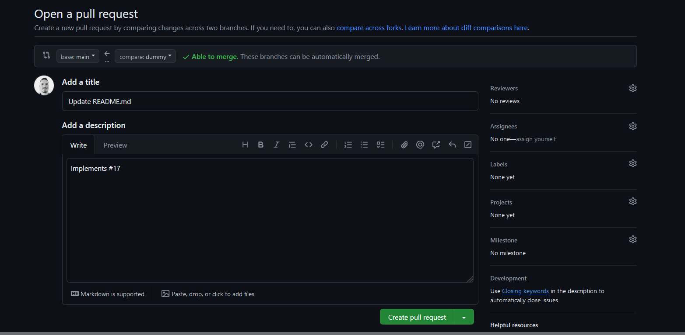
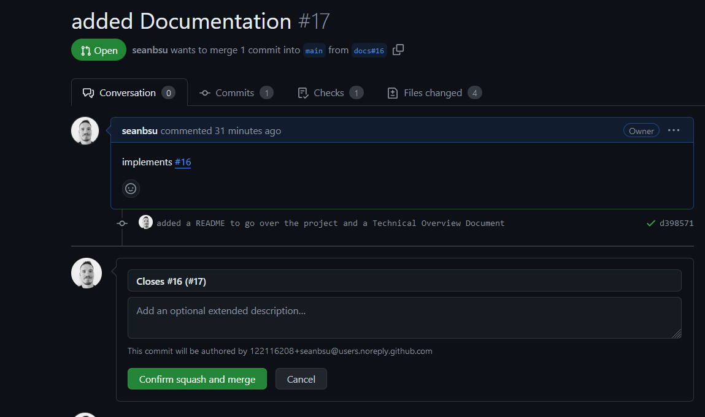

# Contributing

## Issue Assignment
To contribute, browse the `Issues` tab in the repository and find a task you'd like to work on. Comment on the issue indicating your interest in working on it. Once approved, create a fork of the repository to work on your task.

## Pull Requests
When you're ready to submit your work, create a Pull Request (PR) and follow these guidelines:

- **Title**: Create a concise title that describes the work completed.
- **Description**: In the PR description, on the first line, include `Implements #IssueNumber` to link the PR to the relevant issue.
- **Comments**: Do not include any other comments in the description.

Your PR should look something like this:

When ready, add an admin as a reviewer to get approval for your PR.

## Merge
Once your PR is approved, and all checks have passed, use the "Squash and Merge" option to merge your changes into the `main` branch.

1. **Delete Commit Messages**: Remove all commit messages from the extended description.
2. **Rename Title**: Rename the title to follow the format `Closes #IssueNumber (#PRnumber)`.

Example:

